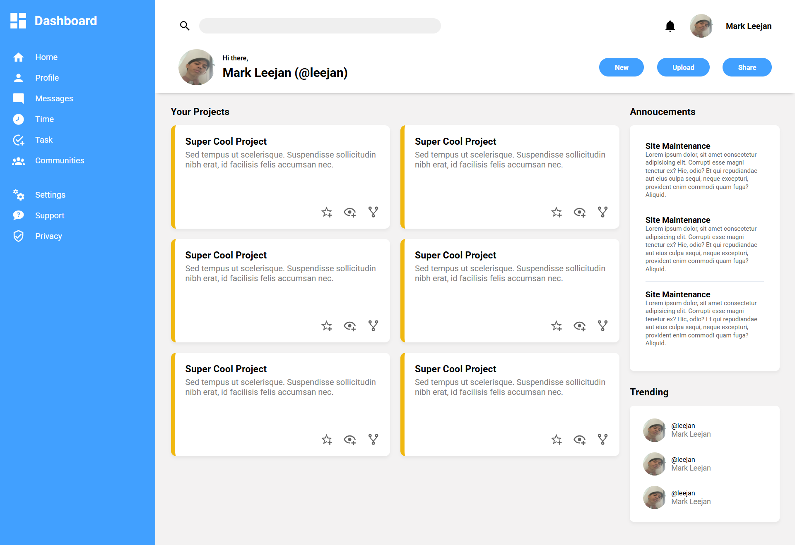

# Admin Dashboard
The last project of [Intermediate HTML and CSS](https://www.theodinproject.com/lessons/node-path-intermediate-html-and-css-admin-dashboard). 

# Project Overview

# What I've Learned and Improved on
- I can now analyze wheter a container needs to be `Flex` or `Grid`
- Became more familiar with using `Grid` and its properties 
- A little bit of transform

